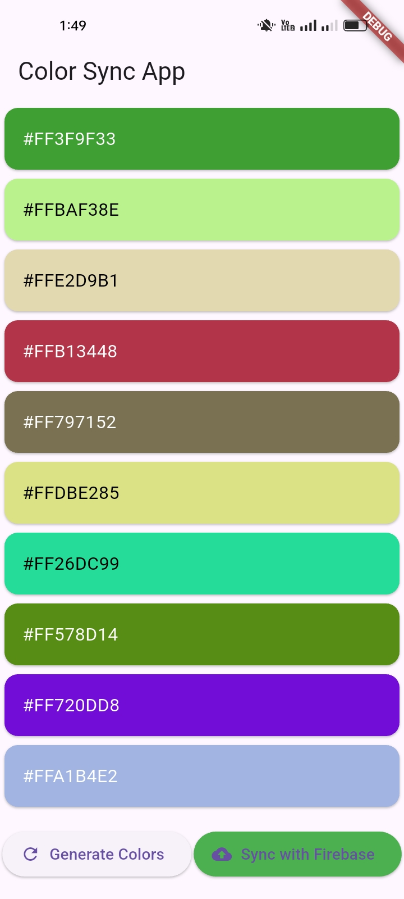

# 🎨 Color Sync App

A cross-platform Flutter application to generate, store, and sync color codes. It works offline using `shared_preferences` and syncs to Firebase Cloud Firestore when online.

---

## ✨ Features

- 🔀 Generate random color codes
- 🎨 Display color codes on cards with HEX values
- 📦 Store data locally using `shared_preferences`
- ☁️ Auto-sync with Firebase Firestore when online
- 📡 Connectivity-aware sync handling
- ⚠️ Robust error and persistent state management

---

## 🛠 Tech Stack

- Flutter (Dart)
- Firebase Cloud Firestore
- `shared_preferences`
- `connectivity_plus`

---

## ▶️ Demo Video

📽️ [Click here to watch the demo](https://drive.google.com/file/d/14rl3VoYvAM9WH5Zfob1EdfD4M6kTwN3H/view?usp=drive_link)

---

## 🖼️ Screenshots

### 🟢 Generate Color Codes


### ☁️ Firebase Sync in Action
![Firebase Sync]## Firebase Sync Screenshot


---

## 🚀 How to Run Locally

```bash
git clone https://github.com/YOUR_USERNAME/color_sync_app.git
cd color_sync_app
flutter pub get
flutter run
